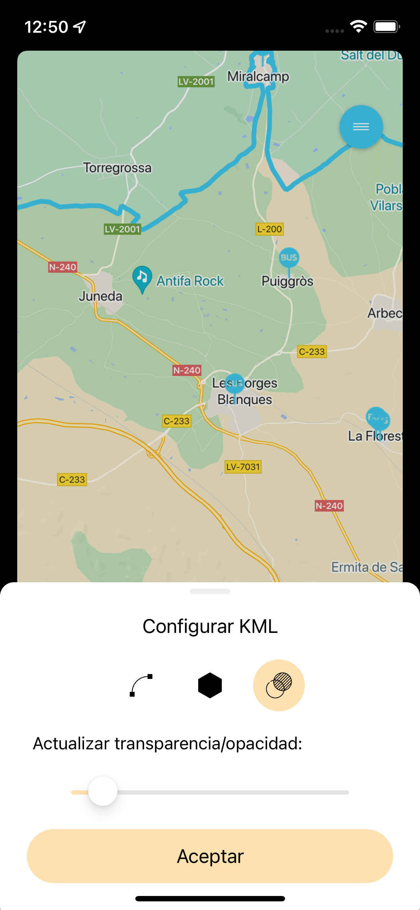
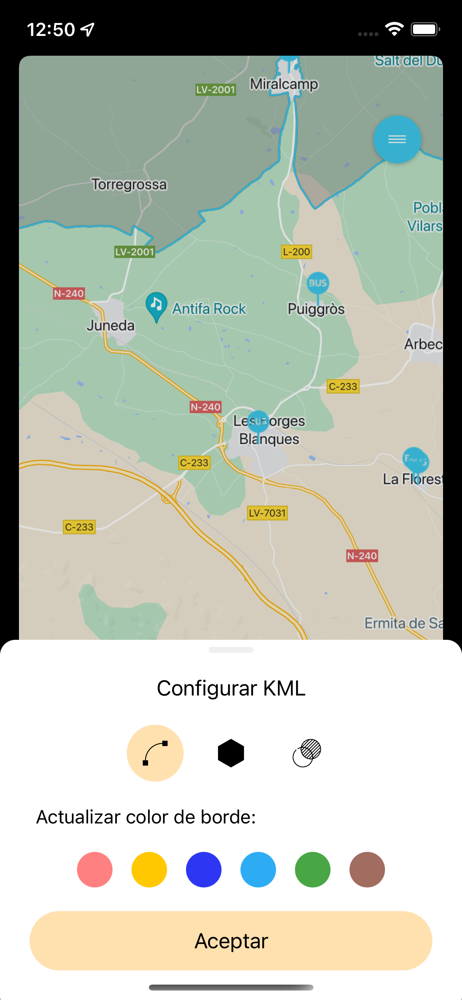
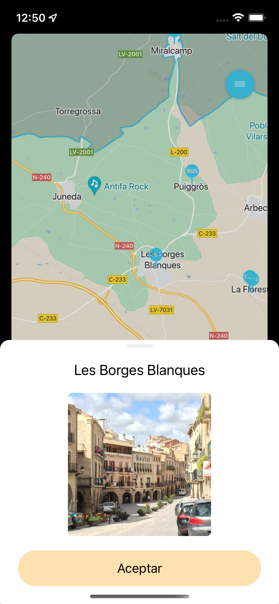
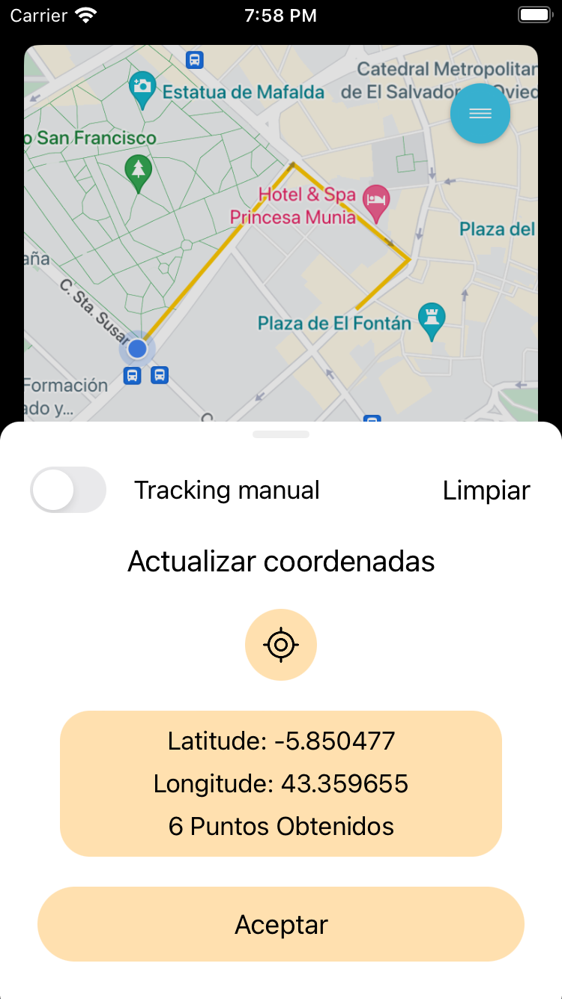

Seresco Maps Utils iOS
=======

## Description

A maps utils library for iOS using Google Maps Api

- **Tracking**
- **KML**
- **Cluster**
- **Markers**

<p float="left">
  
  
  
  
</p>

Usage
--------

e.g. Displaying Tracking Panel

```swift
import SerescoMapsUtils


let trackingUtils = TrackingUtils()

func openTrackingPanel() {
    trackingUtils.currentViewController = self
    trackingUtils.openTrackingPanel()
}

func showTrackedRoute() {
    trackingUtils.showSavedCoordinates(googleMap: self.mapView)
}
```

e.g. Using KML, Markers and Cluster Utils

```swift
import SerescoMapsUtils


let kmlUtils = KMLUtils()
let markerUtils = MarkerUtils()

// import kml map data
func importKmlData() {
     let layer = kmlUtils.retrieveKml(map: mapView, pathResource: "name_of_kml_resource", strokeColor: UIColor.black, fillColor: UIColor.gray, strokeWidth: 2)
     layerSpain.render()
}

// show KML Settings Panel
func openKmlSettingsPanel() {
    let vc = KmlSheetViewController()
    present(vc, animated: true, completion: nil)
}

// import Markers and Cluster data
func showPlacesLocations() {
     markerUtils.retrieveMarkers(map: self.mapView, resource: "name_of_cluster_resource", icon: "name_of_icon")
}
```

Installation
--------

#### CocoaPods

```ruby
source 'https://github.com/CocoaPods/Specs.git'
platform :ios, '12.0'
use_frameworks!

target 'MyApp' do
  pod 'SerescoMapsUtils', '~> 0.0.1'
end
```
